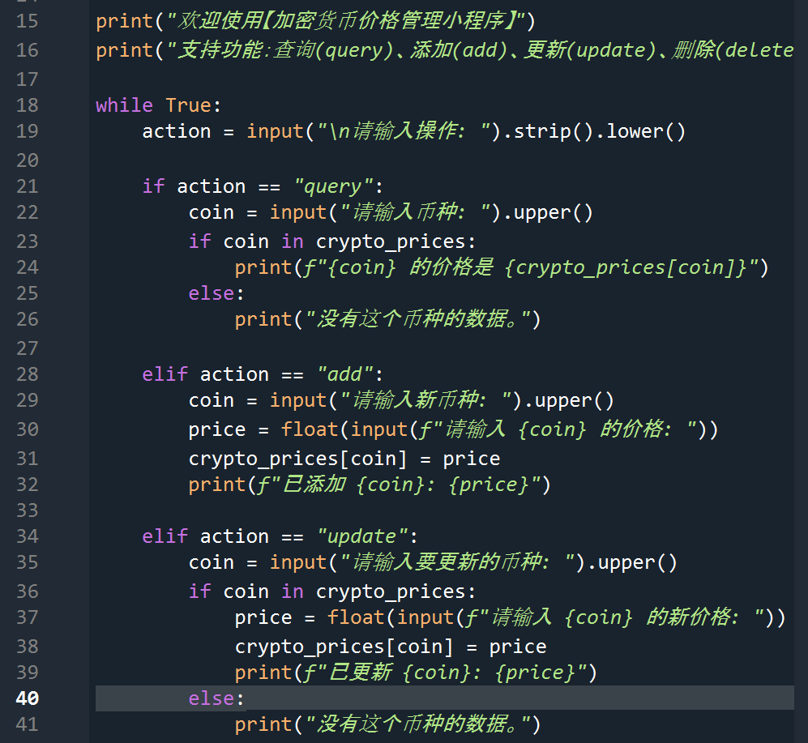

# Crypto Price Tracker

A simple Python desktop app to track real-time cryptocurrency prices.  
Built with `tkinter` and `requests`.

## Features
- Real-time price update (BTC, ETH, etc.)
- Simple GUI interface
- Easy to run

## How to Run
1. Clone the repo
2. Install requirements: `pip install requests`
3. Run the script: `python crypto_tracker.py`

## Demo

